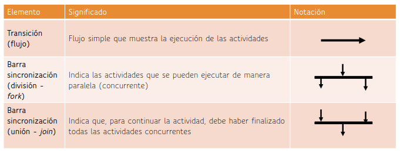
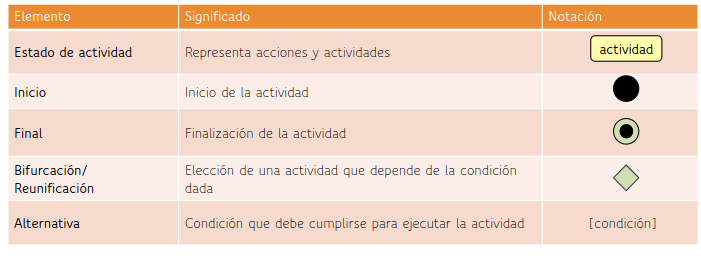

# Taller diagramas de actividad

Este taller tiene la finalidad de hacer la creación de los diagramas de actividad teniendo en cuenta diferentes elementos los cuales compoenen las estrucutas como lo son:

---
## Estructura repositorio
~~~txt
.
├── Diagrama de Actividad (Insertar Cliente).vpp
├── Diagrama de Actividad (Seleccion).vpp
├── Diagrama_de_actividad(Modificar_Cliente).vpp
├── Enunciado_gestion_clientes.pdf
├── Imagenes_diagramas
│   ├── base.png
│   └── flujos.png
└── README.md
~~~

## Ejercicio diagramas de actividad
Se plantea un sistema de gestión bancaria en el cual se identifica un caso de uso en el cual se hace la gestion de un cliente tal que debemos hacer una correcta actualización de los registros de los clientes, tal que se requiran diferentes elementos los cuales son.
### Acciones a realizar
1. Selección de la opción especifica de gestión de clientes.
2. Insertar cliente.
3. Modificar cliente.
4. Eliminar cliente.
5. Cursos alternos teninendo en cuenta la sección.
6. Adición de post condiciones.
